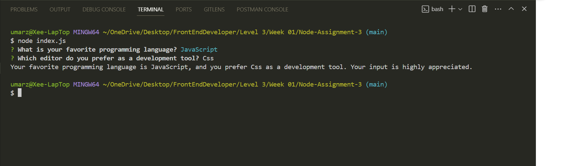

# Node-Assignment-3

## Objective
Create a modular Node.js command-line survey tool that collects users' programming preferences using the Inquirer package. This tool will demonstrate your ability to structure code into modules for different survey questions and integrate user input handling in a cohesive application.

## Instructions
### Step 1: Initialize Project and Repository
- Createdd a GitHub Repository 
- Name it Node-Assignment-3 and Initialized it with README and a .gitignore file for Node.js.
#### Local Setup:

- Cloned the repository and navigated into it.
- Ran npm init -y to create a package.json file.
- Installed Inquirer with npm install inquirer.
### Step 2: Structure the Survey
#### Create Modules for Questions:
- In the project, created a questions directory.
- Inside questions, created modules (e.g., favoriteLanguage.js, favoriteTool.js) that exported question objects for Inquirer.
- This will propmt user to provide their response to the survey questions!

### Step 3: Implement the Survey Tool
- Built the Main Survey Application (index.js):
- Imported the Inquirer package and question modules.
- Used Inquirer to prompt the user with the questions imported from - modules.

### Step 4: Log User Responses
- Capture and Display Responses:
- Ran node index.js in terminal, prompting users to provide response to the questions.
After collecting responses, logged a summary to the console, thanking the user for their input and summarizing their preferences.

#### Screenshot of terminal displaying result
